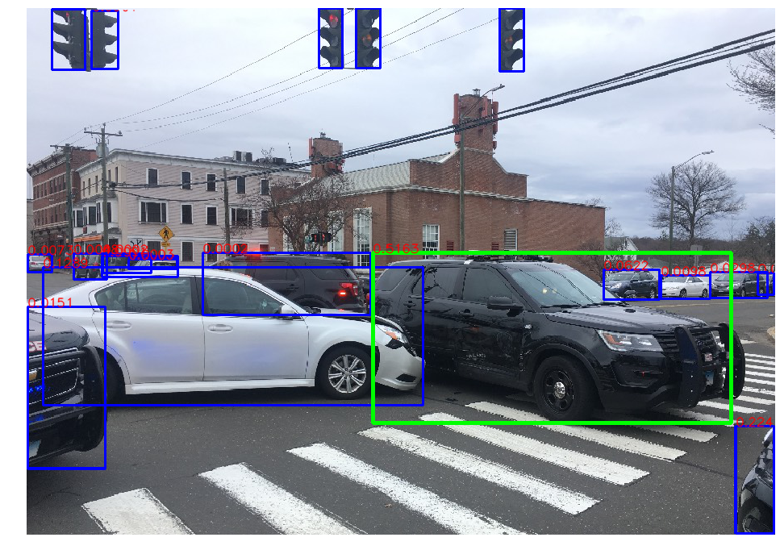

# CrashDetection
Automatic detection and alert of vehicle accidents

    

## Example Crash Detection

    

  This text is purple, <a href="#" class="text-inherit">including the link</a>

Blue boxes are object detected by MaskRCNN.

Green boxes denote objects predicted to have accidents with high confidence.

## Setup
Do `pip install -r requirements.txt`

## Report
[Project Report](https://docs.google.com/document/d/1ExYURXfgFw_NeA226EkDA7B936CK91gzqu2wPWuupuc/edit?usp=sharing)
