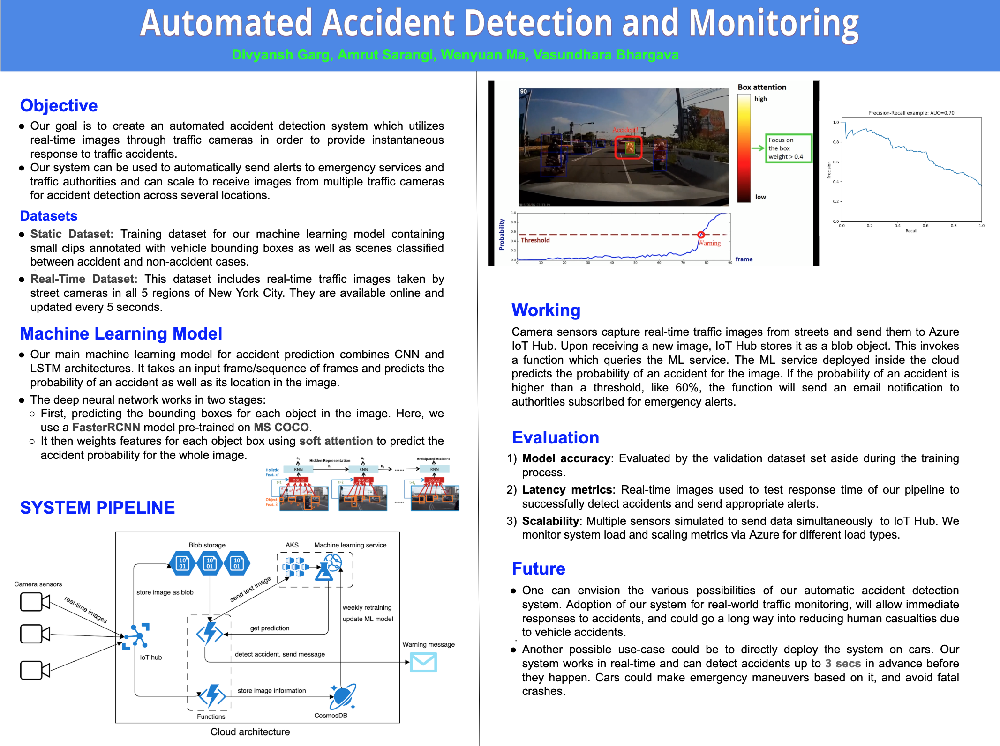

# CrashDetection
Automatic detection and alert of vehicle accidents

    

## Setup
Do `pip install -r requirements.txt`

## Report
[Project Report](https://docs.google.com/document/d/1ExYURXfgFw_NeA226EkDA7B936CK91gzqu2wPWuupuc/edit?usp=sharing)
